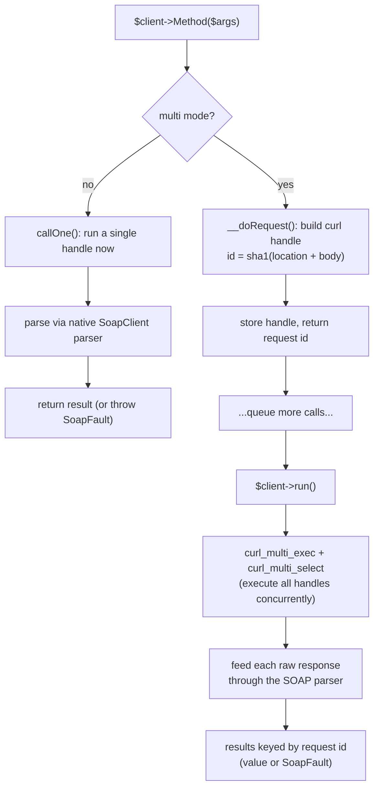
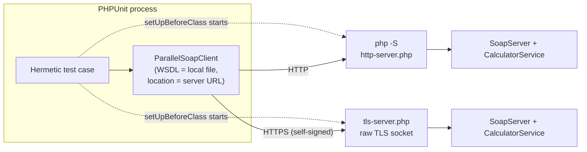

# Development & Local Testing

This document explains what the client does, how it does it, and how to run and extend it
locally. It is meant for contributors and for anyone who wants to understand the internals
before relying on the library.

## The problem

PHP's native `SoapClient` sends one request at a time. When you need several independent
calls — say, pricing five hotels from the same SOAP service — you loop and wait for each
response before sending the next. The calls do not depend on each other, but they still run
back to back, so the total time is the *sum* of every round trip.

```
Native SoapClient (sequential)

 call 1  |■■■■|                                  (200 ms)
 call 2       |■■■■|                             (200 ms)
 call 3            |■■■■|                        (200 ms)
 call 4                 |■■■■|                   (200 ms)
 call 5                      |■■■■|              (200 ms)
                                          total ≈ 1000 ms


ParallelSoapClient (concurrent)

 call 1  |■■■■|
 call 2  |■■■■|
 call 3  |■■■■|     all five share one curl_multi run
 call 4  |■■■■|
 call 5  |■■■■|
              total ≈ 200 ms (the slowest single call)
```

On top of concurrency, routing every request through curl gives you connection reuse, TLS
session sharing, DNS caching and the full set of `CURLOPT_*` knobs (timeouts, proxies,
verbosity) — none of which the native transport exposes.

## How the client works

`ParallelSoapClient` extends `SoapClient` and overrides two things:

1. **`__doRequest()`** — instead of sending the SOAP envelope immediately, it builds a curl
   handle for the request and stores it, keyed by a hash of the location + body. Identical
   requests therefore collapse onto the same handle, so duplicates are sent only once.
2. **`__soapCall()` / `__call()`** — these decide, based on the `multi` flag, whether to run
   the call right away (single mode) or queue it and hand back a request id (parallel mode).

In parallel mode the queued handles are executed together by `run()`, which drives
`curl_multi_exec()` and blocks on `curl_multi_select()` between rounds (so it does not
busy-wait). The raw HTTP responses are then fed back through the *native* SOAP parser, which
turns each one into an ordinary PHP object — or, when a response is malformed or a fault is
returned, a `SoapFault` placed in the results array rather than thrown.



The interesting detail is step `I`: the client reuses the parent `SoapClient`'s parsing by
stashing the raw XML on the instance and calling the parent again with a sentinel method, so
you get the same decoding behaviour you would from a normal synchronous call.

## The local test server

The test suite does not talk to any external SOAP service. Hitting a public demo server makes
tests slow and flaky — the build breaks whenever that third party is down, which has nothing
to do with the code under test. Instead, the suite starts its own SOAP server on a free
localhost port and points the client at it through the `location` option.

There are two servers, both backed by the same WSDL and service class:

- **HTTP** — `tests/Fixtures/http-server.php` runs under PHP's built-in web server
  (`php -S`). `tests/Support/SoapTestServer` picks a free port, launches the process, and
  waits until the port accepts connections.
- **TLS** — PHP's built-in server cannot serve HTTPS, so `tests/Fixtures/tls-server.php`
  terminates TLS itself on a raw stream socket using a self-signed certificate that
  `tests/Support/TlsSoapTestServer` generates at runtime. This exercises the client's
  curl/TLS path end to end.



A key trick keeps this simple: the client loads the WSDL from a **local file**
(`tests/Fixtures/calculator.wsdl`) and overrides the endpoint with the `location` option.
That way no WSDL is ever fetched over the network — only the actual SOAP calls travel over
HTTP/TLS — so the same WSDL drives both servers without certificate or hostname juggling.

The `Calculator` service implements `Add`, `Subtract`, `Multiply` and `Divide` (which throws a
`SoapFault` on divide-by-zero). Both servers also special-case a `Crash` operation: they reply
with a non-XML body so the suite can verify how the client handles a malformed response
(`looks like we got no XML document`).

## Running the local server by hand

You can start the HTTP server outside the test suite and call it yourself:

```bash
composer dev-server
# Serving on http://127.0.0.1:8999
```

Then, from another shell, point a client at it. Note that the WSDL is loaded from disk and the
endpoint is overridden with `location`:

```php
require 'vendor/autoload.php';

use Soap\ParallelSoapClient;

$client = new ParallelSoapClient(__DIR__ . '/tests/Fixtures/calculator.wsdl', [
    'location' => 'http://127.0.0.1:8999',
    'trace' => true,
    'resFn' => fn ($method, $res) => $res->{$method . 'Result'} ?? $res,
]);

$client->setMulti(true);
$a = $client->Add(['intA' => 4, 'intB' => 3]);
$b = $client->Multiply(['intA' => 6, 'intB' => 7]);

$responses = $client->run();
echo $responses[$a], "\n"; // 7
echo $responses[$b], "\n"; // 42
```

## Running the test suite

```bash
composer install

composer test            # hermetic HTTP + TLS suite (default, no network)
composer test-external   # opt-in tests against public demo services
composer ci              # lint + coding standard + static analysis + tests
```

The default run is fully self-contained. The external tests are tagged `#[Group('external')]`,
excluded from `composer test`, and skip automatically when the demo host is unreachable, so
they never break the build.

## Layout of the test code

| Path                              | Purpose                                                        |
| --------------------------------- | ------------------------------------------------------------- |
| `tests/Fixtures/calculator.wsdl`  | WSDL shared by both local servers.                            |
| `tests/Fixtures/CalculatorService.php` | The backend implementation behind the WSDL.              |
| `tests/Fixtures/http-server.php`  | Entry point served by `php -S`.                              |
| `tests/Fixtures/tls-server.php`   | Raw TLS server with a self-signed certificate.               |
| `tests/Support/SoapTestServer.php`| Starts/stops the HTTP server, picks a free port.             |
| `tests/Support/TlsSoapTestServer.php` | Generates the certificate and runs the TLS server.       |
| `tests/Support/RemoteHost.php`    | Reachability check used to skip external tests.              |
| `tests/Hermetic/*`                | The offline HTTP/TLS/config tests (run by default).         |
| `tests/Crcind/*`, `tests/Dne/*`   | External integration tests (opt-in).                        |

## Coding standards

The project follows **PSR-2** (`composer check-style` / `composer fix-style`) and is analysed
with **PHPStan** at level 5 (`composer stan`). Please run `composer ci` before opening a pull
request; CI runs the same checks across PHP 8.1–8.5.
